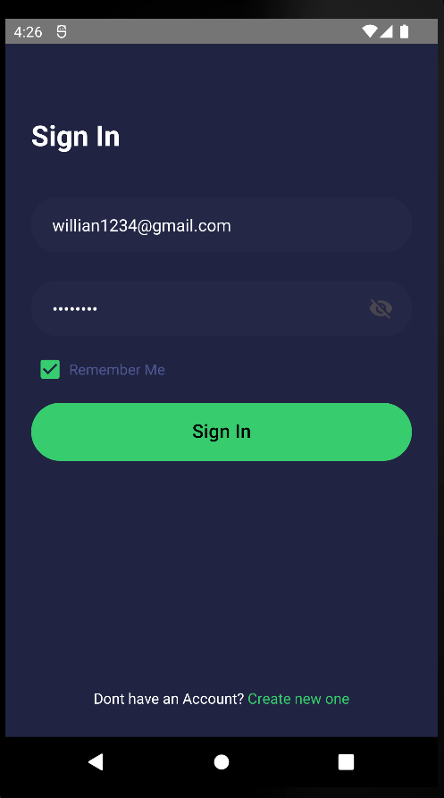
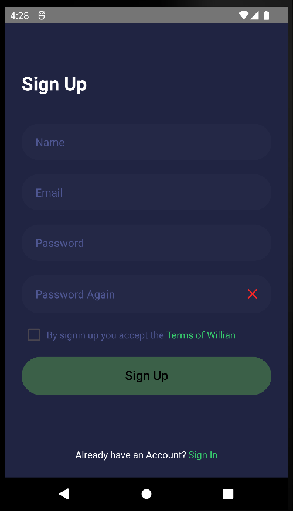
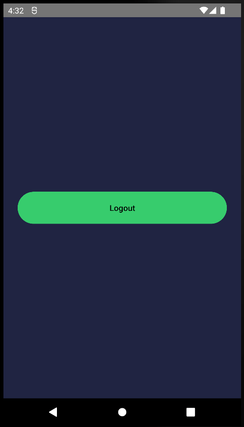

<table align="center">
<tr>
<td align="center" width="9999">

# Sistema de autenticação mobile

*Authenticator mobile system for your application*

</td>
</tr>
</table>

# Páginas

### Login

### Cadastro

### Home 

## Principais Tecnologias

* React Native
* Redux
* localAsyncStorage

## Backend

Link para a API que autentica essa aplicação feita por mim:
https://github.com/Williancc1557/Oauth2.0
